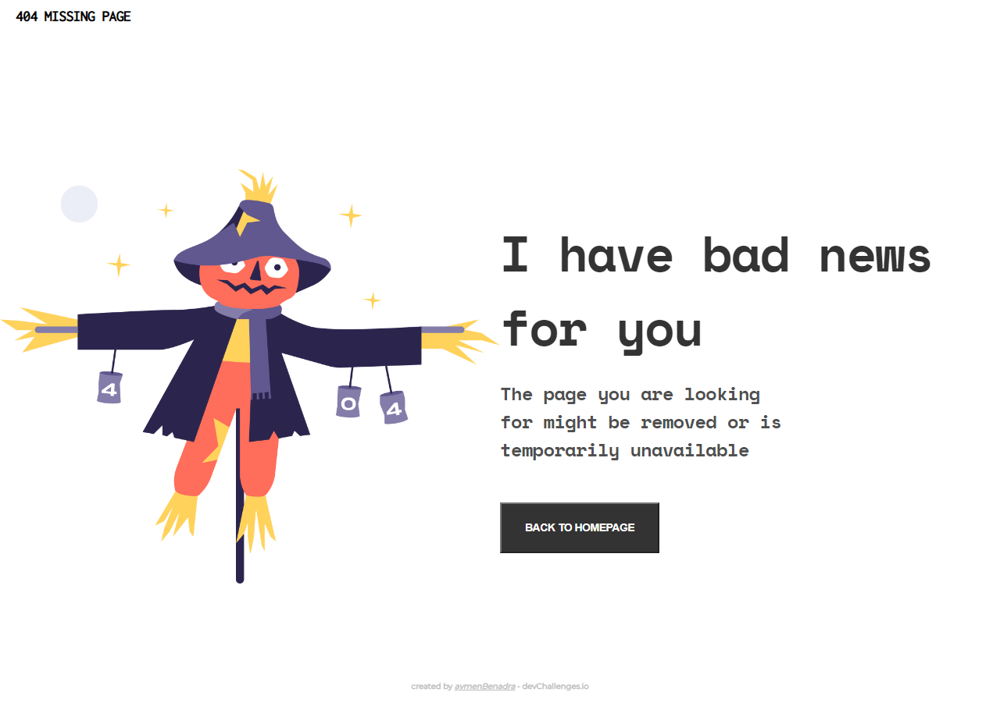

<h1 align="center">404 missing page</h1>

   Solution for a challenge from  <a href="http://devchallenges.io" target="_blank">Devchallenges.io</a>.

  <h3>
    <a href="https://benadra.me/404-missing-page/">
      Demo
    </a>
     | 
    <a href="https://github.com/aymenBenadra/404-missing-page">
      Solution
    </a>
     | 
    <a href="https://devchallenges.io/challenges/wBunSb7FPrIepJZAg0sY">
      Challenge
    </a>
  </h3>

<!-- TABLE OF CONTENTS -->

## Table of Contents

- [Table of Contents](#table-of-contents)
- [Overview](#overview)
  - [Built With](#built-with)
- [Features](#features)
- [Acknowledgements](#acknowledgements)
- [Contact](#contact)

<!-- OVERVIEW -->

## Overview

This is a basic project made with Html and SCSS for learning purposes, as I used concepts and techniques such as Flexbox and many other things. And I also learned how to transform a figma design to Html and CSS code by trial and error.

I encorage everyone who wants to escap the Toturial Hell to try it out, it's so fun! and will help you know your limits sooner, and help you fix it the right way (not by watching more toturials :3).
### Built With

<!-- This section should list any major frameworks that you built your project using. Here are a few examples.-->

- Html and SCSS  
*I used Sass and Html to improve my skils with them both*

## Features

<!-- List the features of your application or follow the template. Don't share the figma file here :) -->

This application/site was created as a submission to a [DevChallenges](https://devchallenges.io/challenges) challenge. The [challenge](https://devchallenges.io/challenges/wBunSb7FPrIepJZAg0sY) was to build an application to complete the given user stories.

## Acknowledgements

<!-- This section should list any articles or add-ons/plugins that helps you to complete the project. This is optional but it will help you in the future. For exmpale -->

- [Steps to replicate a design with only HTML and CSS](https://devchallenges-blogs.web.app/how-to-replicate-design/)

## Contact

- Website [benadra.me](https://benadra.dev)
- GitHub [@aymenBenadra](https://github.com/aymenBenadra)
- Twitter [@aymen_benadra](https://twitter.com/aymen_benadra)
